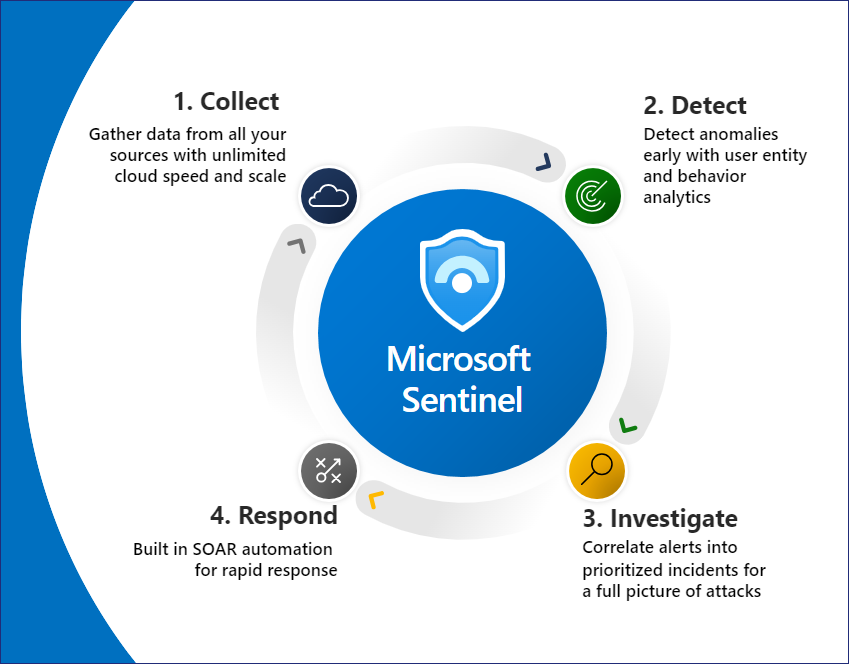

# Deploy & Optimize Microsoft Sentinel 

**Microsoft Sentinel** is a scalable, cloud-native security information and event management (SIEM) that delivers an intelligent and comprehensive solution for **SIEM and security orchestration, automation, and response (SOAR)**. Microsoft Sentinel provides cyberthreat detection, investigation, response, and proactive hunting, with a bird's-eye view across your enterprise.

Microsoft Sentinel also natively incorporates proven Azure services, like **Log Analytics** and **Logic Apps**, and enriches your investigation and detection with **AI**. It uses both Microsoft's threat intelligence stream and also enables you to bring your own threat intelligence.

The deployment phase is typically performed by a **SOC analyst** or related roles.

**Labs are as follows**

**Lab 1** - [Microsoft Sentinel Deployment](<https://github.com/technofocus-pte/sentineltpirdepth/blob/main/Lab%201/Lab%201%20-%20Microsoft%20Sentinel%20Deployment.md>)

**Lab 2** – [Enable Data Connectors in Microsoft Sentinel](<https://github.com/technofocus-pte/sentineltpirdepth/blob/main/Lab%202/Lab%202%20%E2%80%93%20Enable%20Data%20Connectors%20in%20Microsoft%20Sentinel.md>)
